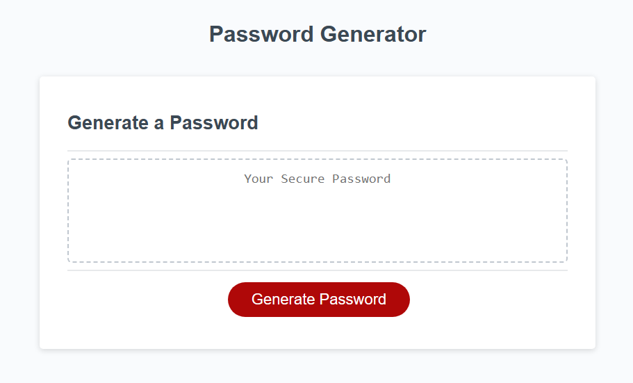

# Password-Pal-JS 🔒🔑

## Description
Welcome to Password-Pal-JS, your trusty sidekick in the realm of password security! This client-side password generator is designed to empower you with 100% random, ultra-secure passwords whilst also offering the flexibility to tailor them to your unique preferences. Dive into the incredible features that make Password-Pal-JS your go-to password companion! 💪 [see more](#Features)

The driving force behind Password-Pal-JS stems from our commitment to revolutionising the way you approach password generation. In a world filled with digital challenges, we understand the importance of having a reliable ally by your side.

Our goal is to rescue you and your team from the tedious task of password creation. By generating robust, secure passwords right on your device, Password-Pal-JS ensures that your sensitive information stays in your hands, eliminating worries about data being stored elsewhere on the internet🚀.

This project takes a user-friendly approach by utilising prompts and confirms to seamlessly collect your requirements. Say goodbye to complex and time-consuming processes; Password-Pal-JS makes password generation a breeze.

## Table of Contents

- [Dev Requirements](#Dev-Requirements)
- [Dev Environment Setup](#Dev-Environment-Setup)
- [Enduser usage instructions](#End-user-usage-instructions)
- [Features](#Features)
- [How to contribute](#How-to-contribute)
- [technologies ](#technologies)
- [Screenshot](#Screenshot)
- [Credits](#credits)
- [License](#license)

## Dev Requirements
Git/GitBash, VS Code, and the source code, of course! 🛠️

## Dev Environment Setup
To get the development environment running:
1. Clone this repo
2. Open the repo folder in VS Code
3. Right-click on `index.html` and open it using the default browser.

- `index.html`: Contains all HTML code for the webpage
- `assets/js/script.js`: Contains all javaScript code for the webapp
- `assets/css/style.css`: Contains all CSS styling for the webapp
- `assets/images/`: Contains all images used in the webpage

## Enduser usage instructions
There is no special requirements for end users. Simply visit [here](https://rossne99.github.io/Password-Pal-JS/) To genatate a new password press on the genarate button, this will ask you a series of questions to taylor the password to your needs

## Features
### Passwords can include the following;
- **Lower case Characters 🔡**
- **Upper case Characters 🔠**
- **Number's 🔢**
- **Special Characters 🔣**

### Passwords are
- **100% Random 👽**
- **Sercure 🔐**
- **Genarated on YOUR device, fully offline 🙅‍♂️**

## How to contribute
1. Fork this repository
2. Clone the repository
3. Create a branch for your bug fix or feature
4. Make necessary changes and commit those changes
5. Push changes to GitHub
6. Create a pull request to this repo to submit your changes for review

## Technologies
- **JavaScript**
- **HTML**

## Screenshot

The following image shows the web application's appearance and functionality:

> **Note**: This applcation is fully responsive.

## Credits 
- **Ross** - Source Code

---

## Licence

MIT License

Copyright (c) 2023 RossNE99

Permission is hereby granted, free of charge, to any person obtaining a copy
of this software and associated documentation files (the "Software"), to deal
in the Software without restriction, including without limitation the rights
to use, copy, modify, merge, publish, distribute, sublicense, and/or sell
copies of the Software, and to permit persons to whom the Software is
furnished to do so, subject to the following conditions:

The above copyright notice and this permission notice shall be included in all
copies or substantial portions of the Software.

THE SOFTWARE IS PROVIDED "AS IS", WITHOUT WARRANTY OF ANY KIND, EXPRESS OR
IMPLIED, INCLUDING BUT NOT LIMITED TO THE WARRANTIES OF MERCHANTABILITY,
FITNESS FOR A PARTICULAR PURPOSE AND NONINFRINGEMENT. IN NO EVENT SHALL THE
AUTHORS OR COPYRIGHT HOLDERS BE LIABLE FOR ANY CLAIM, DAMAGES OR OTHER
LIABILITY, WHETHER IN AN ACTION OF CONTRACT, TORT OR OTHERWISE, ARISING FROM,
OUT OF OR IN CONNECTION WITH THE SOFTWARE OR THE USE OR OTHER DEALINGS IN THE
SOFTWARE.
